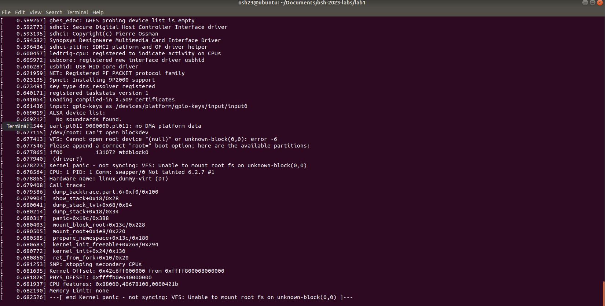
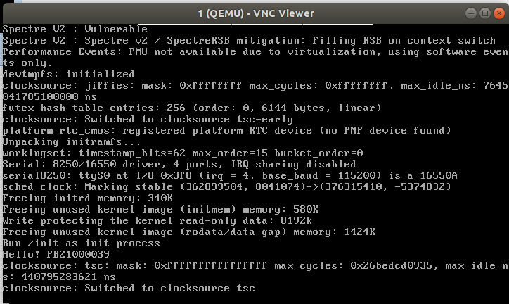
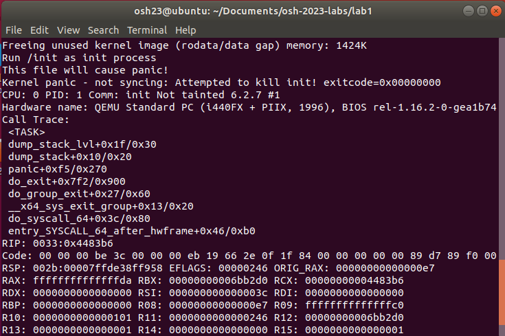
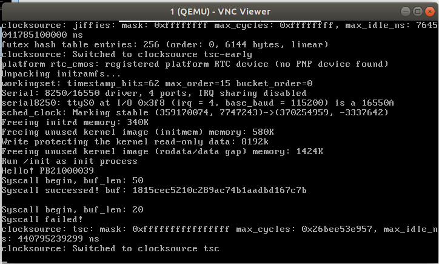

# OSH lab1记录

> **PB21000039 陈骆鑫**

## 1. linux编译

### linux内核裁剪与编译

首先不做修改，使用默认设置，编译出内核大小约14M。

使用`make menuconfig`配置。由于对各个选项含义等等不熟悉，可以逐个选项选择help，确定是否可以取消选择。其中，有的选项在help中已经指出其会增加的内核大小，此类选项一般可以取消勾选；网络、声卡等模块可以断定不需要使用，一概取消勾选；CPU视环境而定，在此处选择`Core 2`。由于一开始对实验目的并非特别了解，不确定各部分是否使用，在取消勾选时较为谨慎，导致最后结果并未特别好。

在简单了解后续实验内容之后，发现使用的只有linux内核中很小一部分，查阅资料后采用较为冒险的策略，直接运行`make allnoconfig`清空大部分选项。之后进入配置菜单，勾选必要内容：(下面选项只是较为重要的一部分，并不完整；完整配置文件已保存于`lab1/.config`)

```
64-bit kernel
Initial RAM filesystem and RAM disk (initramfs/initrd) support
Kernel support for ELF binaries
Maintain a devtmpfs filesystem to mount at /dev
Automount devtmpfs at /dev, after the kernel mounted the rootfs
```

此时编译出的内核镜像只有2MB左右大小，并且编译时间也较短。使用qemu测试，系统运行（由于未指定初始内存盘出现kernel panic）。内核镜像文件已保存为`lab1/bzImage`。

在知道实际只需要很小一部分内核这个"答案"之后，自然也可以反推回过程：从`defconfig`开始，禁用除了必要功能以外的所有选项，也能得到相近的结果。

### 交叉编译arm64下linux并在qemu中运行

首先要按照对应平台安装合适的交叉编译器，这里我使用`aarch64-linux-dnu-gcc`。

在linux源代码中，使用export指定环境变量`ARCH=arm64`，`CROSS_COMPILE=aarch64-linux-gnu-。

指定默认配置`make defconfig`，之后`make ARCH=arm64 CROSS_COMPILE=aarch64-linux-gnu- -j8`开始编译。

同样使用`defconfig`，交叉编译会比同目标平台下编译慢得多。编译完成后将`arch/arm64/boot/Image`复制出，它就是需要的内核镜像文件，保存于`lab1/arm64`目录下。（默认名不是`bzImage`，这里按照默认名不做修改！）

使用qemu测试。qemu同样需要使用目标平台下的版本。这里从官网下载源码，进行如下配置：

```shell
./configure --target-list=x86_64-softmmu,x86_64-linux-user,arm-softmmu,arm-linux-user,aarch64-softmmu,aarch64-linux-user --enable-kvm
```

之后就可以直接`make`了，并`sudo make install`安装。

编译完成后，即可使用`qemu-system-aarch64`，运行命令：

```shell
qemu-system-aarch64 -kernel arm64/Image -M virt -m 2048M -append "rdinit=/linuxrc console=ttyAMA0" -nographic -cpu cortex-a57 -smp 2
```

成功运行Linux系统（因为没有指定文件系统，出现kernel panic）。



## 2. 创建初始内存盘

### 创建过程

此部分较简单，完全按照过程即可（要记得修改学号）。运行结果如下：



内存盘文件保存为`lab1/initrd.cpio.gz`。

### 修改 `init.c` 使编译的内存盘会导致 kernel panic

`kernel panic`是Linux监测到致命错误并无法安全处理时采取的操作。让系统运行不起来当然比让系统正确运行起来简单。`init`会作为第一个用户态进程被启动，成为所有后续进程的父进程；若试图退出`init`进程，就会导致kernel panic。所以最简单的一个办法是，只要将最后的死循环去掉，在`init.c`结束时即出现kernel panic。对应的代码文件见`lab1/panic_init/code`，编译后的`initrd.cpio.gz`在`lab1/panic_init`下。

运行截图如下：


当然，这里有种逆向思维的感觉：前面也说了，让系统运行不起来比让系统正确运行起来简单，实际上在结尾加一个死循环就是为了防止退出`init`，将这部分删除自然会kernel panic。其它让系统不正常运行的方式也有很多，例如“试图读写无效或不允许的内存地址”(wikipedia)。

## 3.添加自定义系统调用

### 添加一个自定义的 Linux syscall

添加syscall并编译过程仍然按部就班完成，内核文件保存为`lab1/syscall/bzImage`。

查阅提供资料，发现两参数系统调用的可以如下调用：`syscall(id, param1, param2)`，其中`id`就是我们记住的548，返回值为系统调用的返回值。

我们将测试syscall封装为一个函数，并根据返回值不同输出不同内容：

``` c
void check_syscall(char *buf, int buf_len){
    printf("Syscall begin, buf_len: %d\n", buf_len);
    long ans = syscall(548, buf, buf_len);
    if (ans == 0){
        printf("Syscall successed! buf: %s\n", buf);
    } else {
        printf("Syscall failed!\n");
    }
}
```

之后，在main函数中只需以不同的参数调用该函数进行测试即可。我们不妨对`buf`长度充足和不足时各测试一次：

```c
int main() {
    printf("Hello! PB21000039\n");
    char buf_OK[50], buf_FAIL[20];
    check_syscall(buf_OK, 50);
    check_syscall(buf_FAIL, 20);
    while (1) {}
}
```

使用qemu测试，得到期望结果：



完整代码也可以在`lab1/syscall/initrd.c`中找到。