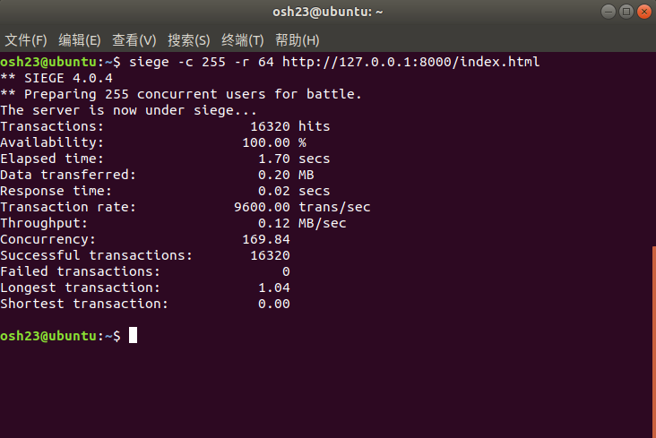
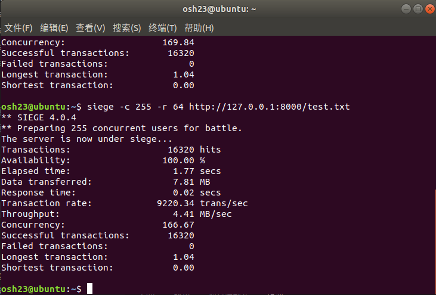
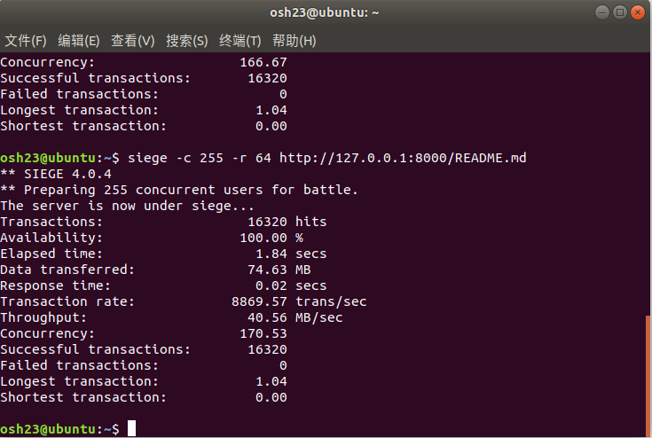
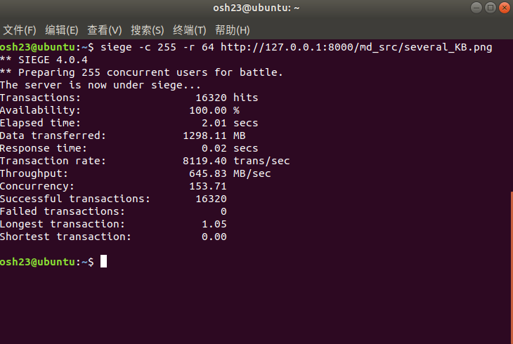
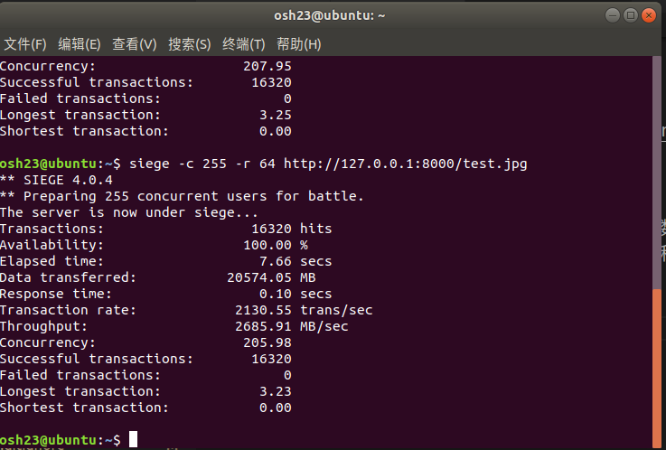
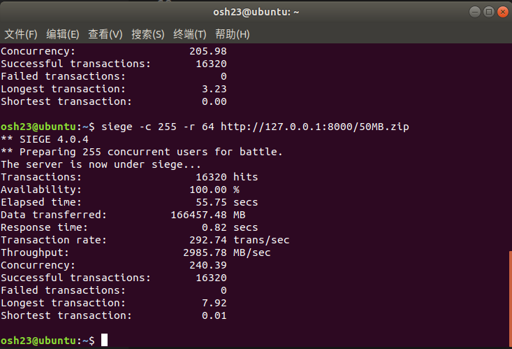
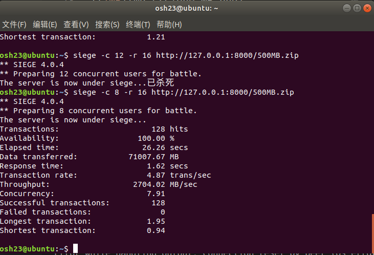

# Lab3实验报告

## 编译和运行方法

本次实验使用Cargo创建Rust语言项目，编译方式与一般Cargo项目相同，在lab3目录下运行`cargo run`即可。

## 整体设计

> Rust团队认为高并发场景也是Rust语言的设计面向场景之一。因此，在Rust语言的官方教程([the book](https://doc.rust-lang.org/book/))和诸多第三方教程中，都将实现一个多线程服务器作为一个重要的教学项目。本实验参考了the book中的部分设计、思想和技术。

与提供的C语言项目类似，本项目也是从一开始的一个简易单线程服务器原型开始，逐步重构、发展的。初始项目的逻辑如下：
- 使用一个死循环处理到来的每一个请求
- 简单解析请求，判断状态码
- 发送状态码对应状态行，之后不再发送任何内容

这个项目只比示例项目略胜一筹（进行了简单的状态码判断）：Rust标准库为我们避免了大量的底层操作，让我们可以分出更多的精力在任务本身之上。当然，示例程序的缺点这个程序一样都有。接下来，以必做部分给出的四个任务（四个小标题）为指引，改进本项目。

### 并发请求处理

分析本实验的要求，我们发现可以直接对每个请求创建一个线程，仍然调用之前的函数，不会发生并发问题。这是因为不同进程处理不同请求，不会产生先后顺序上的冲突，也不涉及到线程间的相互通信、共享数据等（这一点在选做部分会被打破）。

### 解析和检验HTTP头

首先，我们设计一个抽象类`InputHandler`，负责接收数据，并解析出路径。收到的HTTP请求可能是畸形的，因此我们的解析函数返回`Result<String, E>`类型。函数的检验工作如下：
- 在第一个空行前是否至少有一行；
- 第一行是否恰好为三个单词；
- 第一个单词是否为"GET"，第三个单词是否为"HTTP/1.0"；
- 这个路径是否尝试跳出项目主目录。

在确认通过这些测试后，函数才返回一个代表路径的字符串。

之后这个路径会被用于进一步解析响应码。这一项工作由结构体`Status`的构造函数完成；构造函数运行完成后，结构体将包含状态码和路径本身。根据要求描述，构造函数的工作如下：
- 若前一个检验函数返回错误值，状态应为500；
- 若请求路径不存在，状态为404；
- 若路径为目录，状态也为500；
- 否则，状态为200。

至此，所有的解析、检验工作已经完成。

### 实现读取请求资源内容

状态码不为200时，后续内容为空，只要像示例程序一样返回即可。

状态码为200时，需要返回文件的内容。由于请求可能为二进制文件，我们应该以二进制形式读取文件，之后写入到TCP流之中。

这个过程不能直接使用`std::fs::read`等等尝试一次读入全部内容的函数。多数情况下，它有机会完成全部内容的读取，但在多线程、大文件的情况下，这会快速耗尽内存，使程序被系统杀死。

因此，我们采用有缓冲区的(buffered)I/O，在Rust中，标准库为我们提供了`BufReader`和`BufWriter`两个类型处理。需要注意的是，就算采用了缓冲区，也不能假定一次可以读/写完缓冲区内的数据，仍然要循环处理。

本实验中，我给每个线程分配了64K大小的缓冲区（仅对1M左右文件大小而言，再提高缓冲区大小的边际效应已经不高），尽量避免多次在读写过程间切换，同时也不至于占用过多内存（siege最多能够同时发送255个请求，因此占用内存在16M左右；实际测试也认为占用内存极小）。

### 实现错误和异常处理

在本实验中，我们可以看到绝大多数错误都局限在单个连接中，不应因此结束整个程序，因此我们在绝大多数地方采用`Result<T, E>`，而不直接`panic!`。

Rust语言为我们提供了优美的错误处理方式。其中最方便的一个模式叫做"传播错误"。它允许在一个函数中每当错误发生时直接结束当前函数的运行，将错误进一步返回上一级处理，只需要使用"?"运算符。

使用该模式，当大多数错误发生时，我们将其传播到上一级，并最后在主逻辑中统一判断。对所有的错误，我们都在标准错误流中输出它，并视发生场合的不同进行不同的处理：
- 在连接中或写入的错误直接丢弃并关闭连接（这样的错误大多情况下是不可恢复的）。
- 在读取或解析中发现的错误，无论原因，我们都应该尝试向用户返回500状态码（这部分逻辑在上面已经提到了）。

## Siege测试

对于小文件，我们直接尝试高并发、多次测试。下面几次测试的文件大小分别在数字节、百字节、千字节、百KB级别：

可以看到，在小文件时，相同时间内传输文件的数量和延迟是相近的；因为此时服务器的性能瓶颈在线程创建等和传输文件无关的部分上。

接下来是三个大文件，相差各约一个数量级。

对于前两个文件，255并发尚且能够跑出来。可以看到延时和每秒响应数都明显变差，但吞吐率提高了。显然，这时的吞吐率已经受到了硬件的制约，导致其它参数变差。

对于500M的大文件，虽然服务器尚无压力（因为采用了缓冲），但是若尝试高并发，siege会被操作系统杀死，所以这里只能使用并发数很小的测试。

可以看到，对很大的文件，也能够基本跑满硬件的限制。

以上所有测试均进行了多组，相同参数表现相近，更小参数的表现非常好。另外，以上进行的所有测试中Availability均为100%，没有出现失败传输，体现了服务器的稳定性较强。

